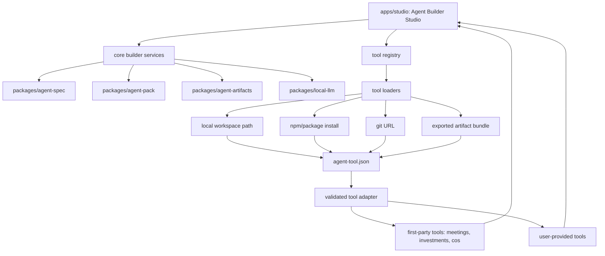

# Standalone Tool Strategy

Date: 2026-07-06

## Bottom Line

Agent Builder Studio should keep standalone tools modular, but the Studio should not depend on arbitrary app internals or cloned repo layouts. The durable design is a core Studio shell plus shared engine packages, with standalone tools loaded through a validated manifest and adapter contract.

Use a hybrid model:

- Keep core Studio, graph/spec/runtime/packaging, artifact, and model-routing code in this monorepo.
- Treat domain tools as installable modules, even when first-party examples still live in this repo.
- Let future users add their own tools through a local path, package, git URL, or exported bundle once the manifest contract is stable.

This gives users extensibility without making the primary app feel like a pile of unrelated repos.

## Current Assessment

The repo is confusing because `apps/` contains several different kinds of things:

- `apps/agent-studio` is the primary product surface users should launch.
- `apps/agent-builder` is legacy Builder UI plus useful tooling and historical scaffolding.
- `apps/meetings`, `apps/investments`, and `apps/cos` are domain apps extracted from earlier Builder work.
- `apps/chief-of-staff` is an older standalone Node Chief of Staff surface retained for compatibility.
- `packages/` contains the cleaner reusable core: agent specs, package generation, artifacts, and local model routing.

If this were built from scratch, the repo would make the primary launch path obvious and would classify every other surface as either core engine, first-party tool, legacy compatibility, or archive.

## Tool Fit Map

| Current surface | Current role | Target home | Load or ingest model | Notes |
| --- | --- | --- | --- | --- |
| `apps/agent-studio` | Primary visual builder and runtime workbench | Future `apps/studio` rename, after a focused migration | Built-in shell, not ingested as a tool | This is the app users launch. Keep root `npm run dev` pointed here. |
| `apps/agent-builder` | Legacy Builder UI, plugin companion work, sandbox scripts, agent structures, DoE scripts, export experiments | Split into `apps/builder-tools` plus reusable packages | Internal builder packages, not a user-facing domain tool | This is the biggest source of repo confusion. Extract useful tooling and archive historical UI/docs. |
| `apps/meetings` | First-party meeting analysis tool | First-party standalone tool | Manifest-loaded local workspace tool | Good candidate for the first `agent-tool.json` example because inputs/outputs are concrete. |
| `apps/investments` | First-party investment review tool | First-party standalone tool | Manifest-loaded local workspace tool | Should declare data sources, required permissions, outputs, and report format. |
| `apps/cos` | Next.js Chief of Staff side app | First-party standalone tool | Manifest-loaded local workspace tool | Likely the canonical Chief of Staff tool if it replaces the older Node app. |
| `apps/chief-of-staff` | Older standalone Node Chief of Staff app | Archive or convert to compatibility adapter | Legacy adapter only if still needed | Keep only if it provides behavior not covered by `apps/cos`. |
| `packages/agent-spec` | Shared graph/spec schema, validation, defaults, roles | Core package | Direct dependency | This should define or reference the tool manifest contract. |
| `packages/agent-pack` | Deterministic spec-to-package generation | Core package | Direct dependency | Used by Studio and tool packaging flows. |
| `packages/agent-artifacts` | Local artifact staging and promotion | Core package | Direct dependency | Tools should write artifacts through this layer instead of ad hoc file output. |
| `packages/local-llm` | Local-first model routing and fallback client | Core package | Direct dependency | Studio should expose only available local/API-backed models through this package. |
| `@tyroneross/omniparse` (external npm) | Document/transcript parsing SDK | External published dependency | npm dependency of `agent-studio` + `meetings` | Not in this repo. `meetings` reaches it via the `OMNIPARSE_SDK_PATH` env var (declared in its manifest), no longer a hardcoded absolute path. |

## Proposed Architecture



The important rule is that Studio only talks to tools through the same adapter contract. First-party tools can stay in the monorepo during development, but they should be consumed as if they were external modules.

## Recommended Tool Contract

Add a small manifest such as `agent-tool.json` to each standalone tool:

```json
{
  "schemaVersion": "agent-builder.tool.v1",
  "id": "meetings",
  "name": "Meetings Analyzer",
  "type": "workflow-app",
  "entry": {
    "kind": "next-app",
    "workspace": "apps/meetings",
    "devCommand": "npm run dev --workspace apps/meetings"
  },
  "capabilities": [
    "file-upload",
    "transcript-ingest",
    "summary-report"
  ],
  "inputs": [
    {
      "id": "transcript",
      "type": "file",
      "required": true
    }
  ],
  "outputs": [
    {
      "id": "report",
      "type": "markdown"
    }
  ],
  "permissions": {
    "filesystem": "ask-first",
    "network": "ask-first"
  }
}
```

The manifest should be validated before Studio imports or launches a tool. The first version can be intentionally small: identity, entrypoint, capabilities, inputs, outputs, permissions, and compatibility version.

## Separate Repos vs Monorepo

Separate repos make sense as a supported ingestion mode, not as the only first-party development model.

| Option | Benefits | Costs | Recommendation |
| --- | --- | --- | --- |
| Keep all tools in this monorepo | Easier refactors, shared tests, simpler local development, fewer version mismatches | Repo can feel cluttered if every app sits beside Studio | Good while contracts are still changing. |
| Split each tool into a separate repo | Cleaner ownership, independent release cycles, matches user-provided tool model | Version drift, install complexity, security review, harder cross-repo changes | Good after a tool contract exists and the tool is stable. |
| Hybrid registry model | First-party tools can live anywhere, but Studio consumes all tools through one contract | Requires manifest/schema work up front | Best target state. |

The practical path is to keep first-party tools here until the manifest and adapter are proven, then optionally split stable tools into separate repos. Studio should support external user tools without caring whether the source is first-party or third-party.

## Migration Plan

1. ✅ **Done (v1).** Define `agent-tool.json` schema and validator → `packages/tool-spec` (zero-dep, house-style validator).
2. ✅ **Done (v1).** Add manifests to `apps/meetings`, `apps/investments`, and `apps/cos` → all three validate; discovered by the registry.
3. ✅ **Done (v1).** Add a Studio tool registry → `apps/agent-studio/app/lib/tool-registry.mjs` + `/api/tools/{list,register,unregister}` + `/dashboard` (status, dev command, permissions disclosure, outputs).
4. ⏳ **v2.** Move reusable legacy Builder logic from `apps/agent-builder` into packages or `apps/builder-tools`. (Inventory classified in `docs/LEGACY_TRIAGE.md`.)
5. ⏳ **v2 (decision documented).** Archive or adapt `apps/chief-of-staff` → behavior diff vs `apps/cos` in `docs/LEGACY_TRIAGE.md`; archival itself deferred.
6. ✅ **Done (v1).** Local path ingestion → `POST /api/tools/register` validates + persists external local paths (`.agent-studio/tool-registry.json`).
7. ⏳ **v2.** Package, git URL, and exported bundle ingestion.
8. ⏳ **v2.** Sample external tool repo fixture.

## Open Decisions — Resolved (v1)

Two independent assessments concurred on all five (see `STANDALONE_TOOL_ASSESSMENT_COMPARISON.md`):

1. **Loaded tool opens** → separate local app; Studio is status board + launch command (no spawn in v1; embed = v2).
2. **Trust model** → trusted local code; manifest permissions shown as **disclosure** ("declared by the tool — not enforced by Studio"). Sandbox = v2; `permissions.mode` in the schema makes enforcement a value change, not a schema break.
3. **Installs** → register-only local paths (no install machinery).
4. **Folder** → keep `apps/`; `entry.workspace` decouples identity from location.
5. **Manifest home** → new `packages/tool-spec` (keeps `agent-spec`'s graph-spec contract clean; subpath-export alternative weighed and rejected).

## Acceptance Criteria

The cleanup is working when:

- ✅ `npm run dev` still has one obvious result: Agent Builder Studio at `http://localhost:3030`.
- ✅ Studio has a dashboard at `/dashboard` showing tool status, dev command, permissions, and outputs. *(Project/graph-status/recent-runs panels omitted in v1 rather than mocked — no real source yet.)*
- ✅ First-party tools (meetings/investments/cos) listed from manifests with zero per-tool Studio code.
- ✅ A user can register a local external tool path and see its capabilities/permissions before launching it.
- ✅ No app imports implementation details directly from another app (verified: zero cross-app imports).
- ✅ Legacy Builder functionality documented as compatibility-only + inventoried (`docs/LEGACY_TRIAGE.md`); extraction/archival = v2.
